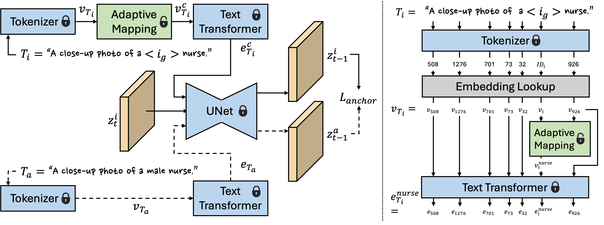

<div align="center">
<h1>AITTI: Learning Adaptive Inclusive Token for Text-to-Image Generation</h1>


[Xinyu Hou](https://itsmag11.github.io/), [Xiaoming Li](https://csxmli2016.github.io/), [Chen Change Loy](https://www.mmlab-ntu.com/person/ccloy/)

<div>
    <sup></sup>S-Lab, Nanyang Technological University
</div>

[Paper](https://arxiv.org/abs/2406.12805) | [Project Page](https://itsmag11.github.io/AITTI/) | [Supplementary Materials](https://entuedu-my.sharepoint.com/:b:/g/personal/xinyu_hou_staff_main_ntu_edu_sg/EVcLbNo4PYRMkPU3C6av5vcBA3igPLn3eAXG58dpbKwjvw?e=kW8gAK)

**International Journal of Computer Vision**
</div>

<br>
<div align="center">

</div>
<br>

## 🚀 Environment Setup

```bash
# Clone the repository
git clone https://github.com/itsmag11/AITTI.git
cd AITTI

# Create a virtual environment
conda create -n aitti python=3.9
conda activate aitti

# Install PyTorch (CUDA 11.8)
pip install torch==2.7.1 torchvision==0.22.1 torchaudio==2.7.1 --index-url https://download.pytorch.org/whl/cu11

# Install dependencies
pip install --upgrade diffusers[torch]
pip install pytorch_lightning facexlib transformers peft clean-fid
pip install git+https://github.com/openai/CLIP.git

# Download pre-trained models and place them in the checkpoints/ directory
```

## 📖 Usage

### 1️⃣ Data Generation

Generate balanced training data for different bias types:

**Gender Bias:**
```bash
cd data_generation
bash generate_gender_data.sh
```

This generates images for male and female representations across various professions.

**Custom Data Generation:**
```bash
python generate_data.py \
    --prompts "a photo of a male doctor" \
    --seed 666 \
    --run_times 100 \
    --output_dir ./output/gender_data \
    --checkface  # Ensures valid face detection and CLIP classification
```

**Quality Control Features:**
- Face detection ensures exactly one face per image (RetinaFace with 0.97 confidence)
- CLIP classification verifies the demographic attribute matches the prompt

For race and age attribute data generation, change the prompts and CLIP classifier in `generate_data.py`.

### 2️⃣ Training

Train AITTI model to learn bias-inclusive token representations:

**Gender Bias Mitigation:**
```bash
cd training
bash train_gender.sh
```

**Custom Training:**
```bash
accelerate launch train_aitti.py \
    --pretrained_model_name_or_path "runwayml/stable-diffusion-v1-5" \
    --train_data_dir "./data/gender_balanced_data.txt" \
    --placeholder_token "<gender-diverse>" \
    --initializer_token "individual" \
    --resolution 512 \
    --train_batch_size 1 \
    --repeats 15 \
    --num_train_epochs 1 \
    --learning_rate 5.0e-04 \
    --output_dir "gender-inclusive" \
    --train_adaptive_token_mapping \
    --num_transformer_head 6 \
    --num_transformer_block 4 \
    --anchor_loss 1000000.0 \
    --is_run
```

### 3️⃣ Inference

**Released Weights:**

| Token | Hugging Face Link |
| :--- | :--- |
| **\<gender-inclusive\>** | [Download](https://huggingface.co/itsmag11/gender-inclusive) |
| **\<race-inclusive\>** | [Download](https://huggingface.co/itsmag11/race-inclusive) |
| **\<age-inclusive\>** | [Download](https://huggingface.co/itsmag11/age-inclusive) |

To use these weights, download `adaptive_mapping.safetensors` and `learned_embeds.safetensors` from the link above.

Generate images using trained AITTI models:

**Gender-Inclusive Generation:**
```bash
cd inference
bash inference_gender.sh
```

**Custom Inference:**
```bash
python inference_aitti.py \
    --prompt "A photo of a <gender-diverse> doctor" \
    --profession_name "doctor" \
    --textual_inversion_dir "./checkpoints/gender-inclusive" \
    --token_name "<gender-diverse>" \
    --seed 666 \
    --run_times 100 \
    --output_dir "./results/gender_doctor" \
    --num_transformer_head 6 \
    --num_transformer_block 4 \
    --checkface
```

### 4️⃣ Evaluation

Evaluate bias in generated images using CLIP:

```bash
python evaluate_clip.py \
    --attribute_to_eval "gender" \
    --root_dir "./results/gender_doctor" \
    --gt_prompt "a photo of a doctor"
```

Get aggregated metrics across multiple professions:

```bash
python get_average_metrics.py \
    --attribute_to_eval "gender" \
    --root_dir "./results/all_professions"
```

## 📝 Citation

If you use this code in your research, please cite:

```bibtex
@inproceedings{hou2025aitti,
  title={AITTI: Learning Adaptive Inclusive Token for Text-to-Image Generation},
  author={Hou, Xinyu and Li, Xiaoming and Loy, Chen Change},
  booktitle={International Journal of Computer Vision (IJCV)},
  year={2025}
}
```

