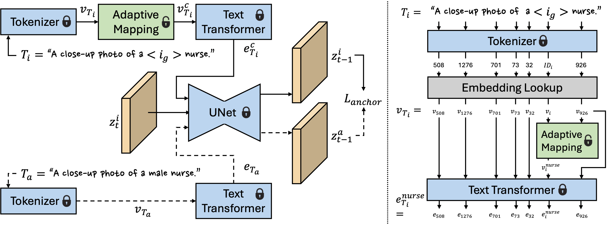

<div align="center">
<h1>AITTI: Learning Adaptive Inclusive Token for Text-to-Image Generation</h1>


[Xinyu Hou](https://itsmag11.github.io/), [Xiaoming Li](https://csxmli2016.github.io/), [Chen Change Loy](https://www.mmlab-ntu.com/person/ccloy/)

<div>
    <sup></sup>S-Lab, Nanyang Technological University
</div>

[Paper](https://arxiv.org/abs/2406.12805) | [Project Page](https://itsmag11.github.io/AITTI/) | [Supplementary Materials](https://entuedu-my.sharepoint.com/:b:/g/personal/xinyu_hou_staff_main_ntu_edu_sg/EVcLbNo4PYRMkPU3C6av5vcBA3igPLn3eAXG58dpbKwjvw?e=kW8gAK) | [🤗 Models](https://huggingface.co/itsmag11/AITTI)

**International Journal of Computer Vision**
</div>

<br>
<div align="center">

</div>
<br>

## ⚡ Quick Start

All released inclusive tokens (`<gender-inclusive>`, `<race-inclusive>`, `<age-inclusive>`) live in a single Hugging Face repo, [itsmag11/AITTI](https://huggingface.co/itsmag11/AITTI). No need to clone this repository:

```bash
pip install diffusers transformers accelerate safetensors
```

```python
import torch
from diffusers import DiffusionPipeline

pipe = DiffusionPipeline.from_pretrained(
    "stable-diffusion-v1-5/stable-diffusion-v1-5",
    custom_pipeline="itsmag11/AITTI",
    trust_remote_code=True,
    torch_dtype=torch.float16,
).to("cuda")

token = pipe.load_aitti("gender")  # "gender" | "race" | "age"  ->  "<gender-inclusive>"
image = pipe(f"A photo of a {token} doctor", num_inference_steps=25).images[0]
image.save("doctor.png")
```

Use prompts of the form `A photo of a <token> <profession>`.

## 🚀 Environment Setup

To train your own tokens or run the evaluation:

```bash
git clone https://github.com/itsmag11/AITTI.git
cd AITTI

conda create -n aitti python=3.9
conda activate aitti

# PyTorch (CUDA 11.8)
pip install torch==2.7.1 torchvision==0.22.1 torchaudio==2.7.1 --index-url https://download.pytorch.org/whl/cu118

pip install --upgrade diffusers[torch]
pip install pytorch_lightning facexlib transformers peft clean-fid "scipy<1.16"  # clean-fid is incompatible with newer scipy
pip install git+https://github.com/openai/CLIP.git
```

## 📖 Usage

| Step | Folder | |
| :--- | :--- | :--- |
| 1️⃣ Data generation | [`data_generation/`](data_generation) | Generate attribute-balanced training images |
| 2️⃣ Training | [`training/`](training) | Learn an inclusive token |
| 3️⃣ Inference & evaluation | [`inference/`](inference) | Generate with the released or your own tokens; compute KL / FID / CLIP score |

The pipeline itself (`StableDiffusionAdaptiveTokenPipeline` with `load_aitti`) is in [`pipelines/aitti_pipeline.py`](pipelines/aitti_pipeline.py); it is the same file as the Hub's `pipeline.py`.

## 📝 Citation

If you use this code in your research, please cite:

```bibtex
@article{hou2025aitti,
  title={AITTI: Learning Adaptive Inclusive Token for Text-to-Image Generation},
  author={Hou, Xinyu and Li, Xiaoming and Loy, Chen Change},
  journal={International Journal of Computer Vision (IJCV)},
  year={2025}
}
```

## 📜 License

This project is licensed under the [S-Lab License 1.0](LICENSE). The pretrained weights are used with [Stable Diffusion v1.5](https://huggingface.co/stable-diffusion-v1-5/stable-diffusion-v1-5), which is subject to the [CreativeML Open RAIL-M License](https://huggingface.co/spaces/CompVis/stable-diffusion-license).
